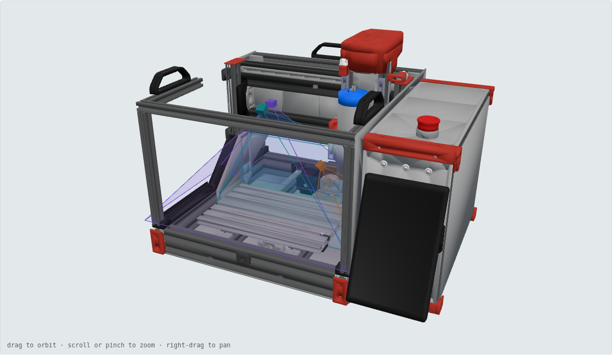
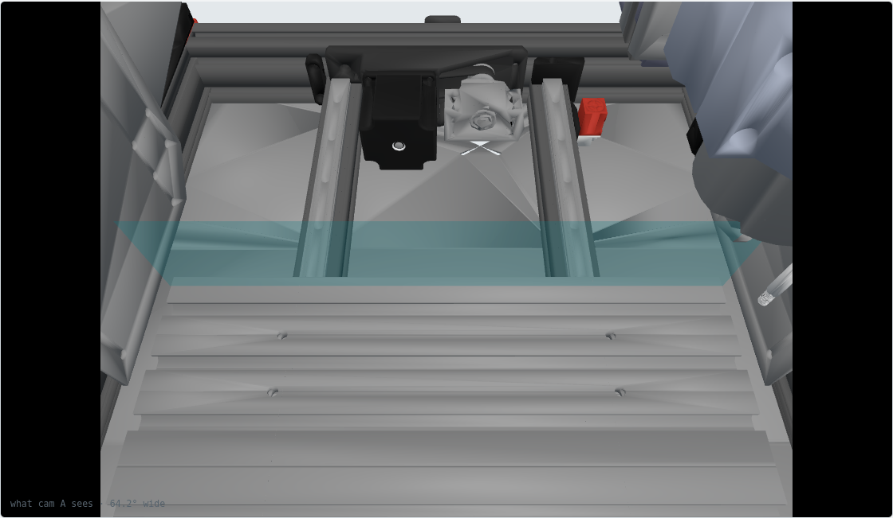
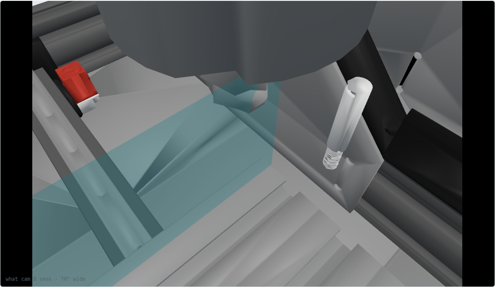
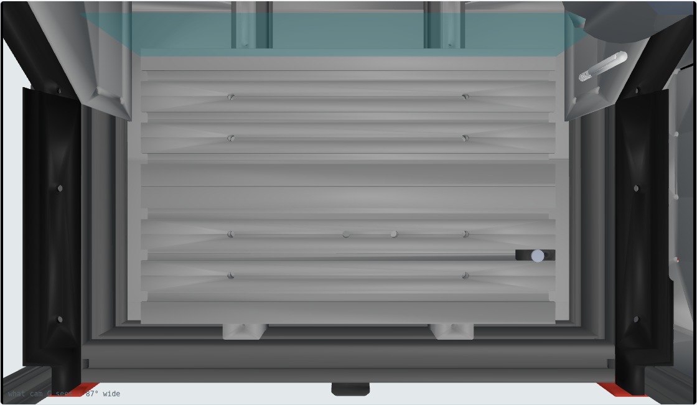
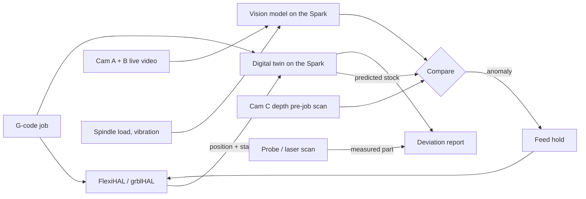

# Vision rig + digital twin

Goal: cameras inside the enclosure, a live digital twin of the machine, and AI
on the DGX Sparks that compares the two while the machine cuts, stops it when
something goes wrong, and measures the result.



## The geometry that makes this easy

The Cascade has a **fixed gantry and a moving table**. In the assembly CAD
(machine frame: X right, D toward the back, U up, mm), the spindle axis sits
at D = 153.5 and only moves in X and Z. The table carries the work along D
underneath it. So every cut happens on one narrow vertical strip:

- X across the table: −129 … 171 (300 mm)
- D ≈ 145 (the front face of the tool)
- U from the table top (−1) up through the stock

The enclosure doesn't need to be blanketed with sensors. Aim sensors at that
strip, at the tool, and at the table's load position.

## The rig

Placements were ray-traced against every part of the configured assembly
(`tools/vision_study.py`, output in `rig.json`). Clear panels and accordion
covers count as transparent. Setup jigs, alternative parts and the optional
above-table tool setter are removed.

| Cam | Job | Example hardware | Mount (machine mm) | Ray-traced result |
|---|---|---|---|---|
| **A** cut-strip overview | Watch every cut, chips, workholding, smoke | Raspberry Pi Global Shutter Camera (IMX296, 1456×1088) + 4 mm CS lens (64°×50°) | Fixed to the front 2020 rail of the working enclosure, at (21, 0, 262), aimed at (21, 150, 20) | **98.2 %** of the strip visible, 0.25 mm/px |
| **B** tool cam | Tool condition, chip formation, edge of cut; same framing every job | Small USB global-shutter module (OV9281 class), ~70° M12 lens, behind an air-purged window | On the Z carriage, front-left of the spindle, at (112, 95, 115), aimed at the tool tip | **98.4 %** of the tool-tip zone visible, 0.125 mm/px |
| **C** stock + fixture depth | Pre-job scan: are the stock and clamps where CAM thinks? | RealSense D405 (87°×58°, 7–50 cm ideal) | Fixed to the top rail, straight down over the table at (21, 40, 262) | **100 %** of the table in frame, ~0.4 mm/px |

| Cam A view | Cam B view | Cam C view |
|---|---|---|
|  |  |  |

Notes:

- Global-shutter sensors because the spindle vibrates and chips fly. A rolling shutter smears both.
- Mount A and C to the 2020 frame, not to a panel that opens, or the calibration moves every time the enclosure is opened.
- Cam B needs a window and an air knife. The `z_carriage_cover_air_mount` variant already brings air to the Z carriage, so tee off it.
- Cam C is for "is anything in the wrong place", not for measuring parts. The D405 is rated ±2 % at 50 cm, so expect around a millimetre at 26 cm.

## Cameras watch, the machine measures

Cameras give tenths to millimetres. Machined parts need hundredths. Do the
precise measuring with the ballscrews:

- **Touch probe.** It's already an optional BOM line, and there are probe variants of the X endstop mount. It measures stock origin and finished dimensions in machine coordinates.
- **Laser-line scan.** A line laser next to cam B, swept by the Y table (or X), turns cam B into a profilometer. Each frame is tagged with machine position from grblHAL, which gives a surface map of the part in the same frame as the twin.

Non-camera signals that catch failures cheaply:

- **Spindle load.** The H100 VFD speaks RS-485 Modbus.
- **Vibration and sound.** An accelerometer on the Z carriage and a contact mic catch chatter and a tool snapping, often before a camera can see it.

## The twin loop



1. **Before the job,** cam C scans the table. The twin checks that the stock and clamps match the CAM setup.
2. **During the job,** the twin replays grblHAL's reported position and removes material from a virtual stock (a heightmap is enough for 3-axis). Cams A and B, spindle load and vibration go to a vision model on the Spark.
3. **On an anomaly,** the Spark sends a feed hold back to grblHAL.
4. **After the job,** the probe or laser scan measures the part, and the twin reports deviation from the model.

## Files

| File | |
|---|---|
| `rig.json` | Camera placements and ray-traced coverage |
| `index.html` | Interactive 3D page: the machine, view cones, and a view through each camera. It loads `cascade.glb` from the same folder (not committed; see below) |
| `renders/` | Screenshots of the page |

## Regenerating

```sh
pip install cadquery trimesh rtree fast-simplification pygltflib
unzip CAD/Voron_Cascade_Assembly_STEP.zip -d /tmp/cascade
python build/tools/step_to_glb.py /tmp/cascade/Voron_Cascade_Assembly.step /tmp/cascade/full.glb 0.4   # ~75 s
python build/tools/slim_glb.py /tmp/cascade/full.glb /tmp/cascade/slim.glb    # drop fasteners, decimate
python build/tools/vision_study.py /tmp/cascade/slim.glb                       # -> build/vision/rig.json
python build/tools/web_glb.py /tmp/cascade/slim.glb build/vision/cascade.glb  # configured machine for the page
# screenshots: npm i three@0.170.0 playwright in build/tools, then
CHROME=/path/to/chrome node build/tools/render_views.mjs build/vision build/vision/renders
```

## Next design steps

- Pick the actual cameras, then design printed mounts for A (2020 rail clamp), B (Z carriage bracket with window and air knife) and C.
- Add the line laser bracket next to cam B.
- Prototype the twin: parse grblHAL status reports and drive the axes of `cascade.glb` (X carriage, Z carriage, table) in the 3D page.
